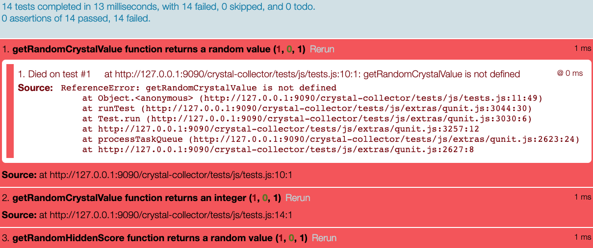

# Crystal Collector Test Suite #

This is a suite of automated tests to help guide development toward building the Crystal Collector game. All of the tests are built to help build your game with clearly separated logic.  As you go through each test, consider how the description (the strings highlighted in red in the test file) lines up with one of the requirements listed in the assignment instructions.

## How to use these tests ##

If you have already started writing code, copy your Javascript source into the game.js file. It is important you leave the game.js file where it is, with the name it has, otherwise the tests won't work correctly.

To run the tests, open `./tests/tests.hml` in a browser and look at the output. If you use LiveServer to open the test file, the tests will automatically rerun as you update the game.js file. If you are not using LiveServer, you will need to reload the page in your browser to rerun the tests with your updated code.

When tests are failing they look like this:

As you pass tests, the screen will update with new counts at the top:

## Helpful Hints ##

The tests rely on the following variables being named exactly:

- `playerScore`
- `hiddenScore`
- `wins`
- `losses`

All of the variables above need to be available to the tests. This means they should not be inside a function.

All variable and function names are case sensitive, so make sure you are getting the spelling and case correct.

By following the tests as a path toward writing functions, you will have most of the game logic complete. This means you should only need to write the DOM manipulations without tests.